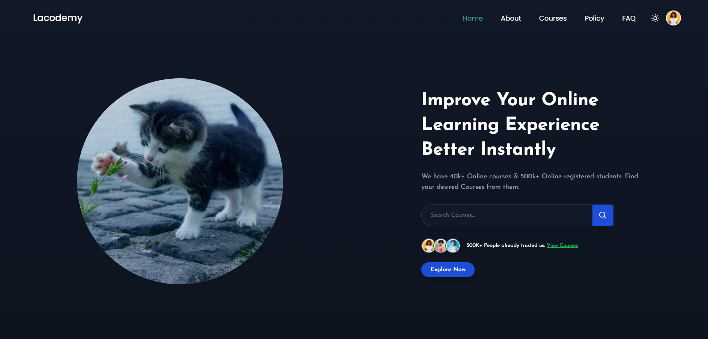
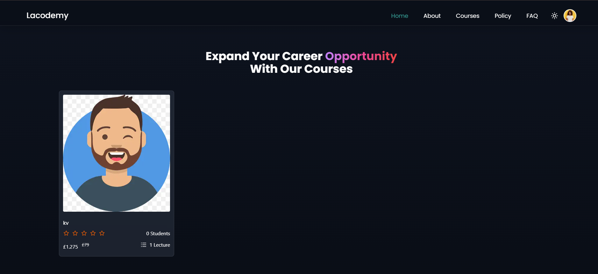
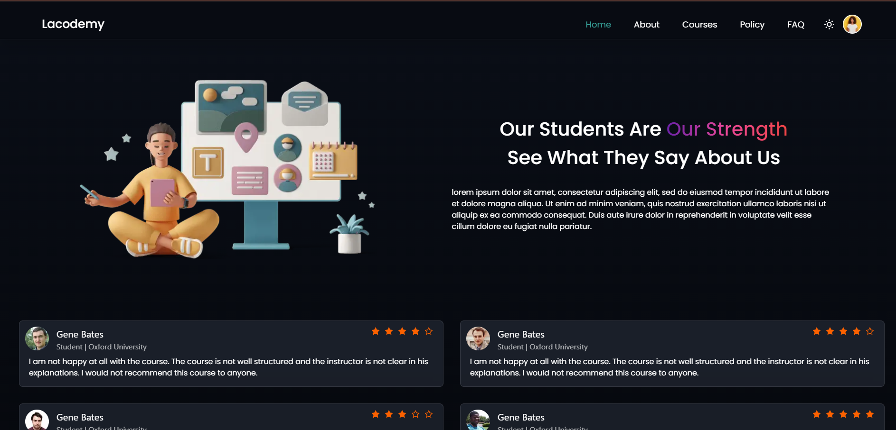
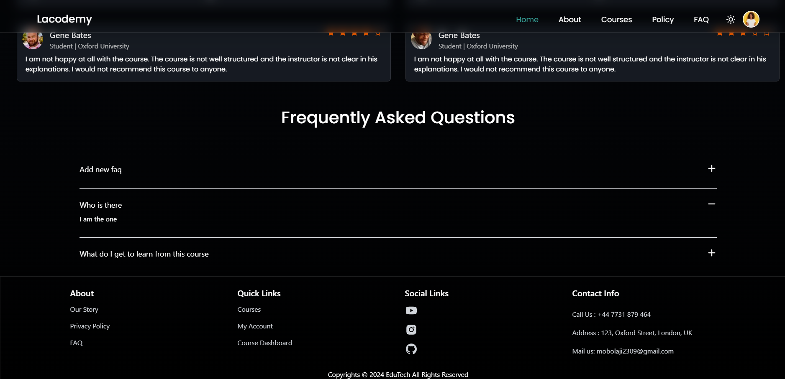

# Lacodemy AI Edtech App






## Introduction

Lacodemy AI is an educational technology app designed to manage and deliver courses efficiently. This repository contains both the client and server code for the application.

## Project Structure

The project is organized into two main subfolders:

- **client**: Contains the frontend code of the application.
- **server**: Contains the backend code of the application.

## Backend API

### Routes

#### Course Endpoints

- **POST /create-course**
  - **Controller**: `uploadCourse`
  - **Description**: Creates a new course.
  - **Middleware**: `updateAccessToken`, `isAuthenticated`, `authorizeRoles('admin')`

- **PUT /edit-course/:id**
  - **Controller**: `editCourse`
  - **Description**: Edits an existing course by ID.
  - **Middleware**: `updateAccessToken`, `isAuthenticated`, `authorizeRoles('admin')`

- **GET /get-course/:id**
  - **Controller**: `getSingleCourse`
  - **Description**: Retrieves a single course by ID.

- **GET /get-courses**
  - **Controller**: `getCourses`
  - **Description**: Retrieves all courses.

- **GET /get-course-content/:id**
  - **Controller**: `getCourseByUser`
  - **Description**: Retrieves the course content for a user by course ID.
  - **Middleware**: `updateAccessToken`, `isAuthenticated`

- **PUT /add-question**
  - **Controller**: `addQuestion`
  - **Description**: Adds a question to a course content.
  - **Middleware**: `updateAccessToken`, `isAuthenticated`

- **PUT /add-answer**
  - **Controller**: `addAnswer`
  - **Description**: Adds an answer to a course question.
  - **Middleware**: `updateAccessToken`, `isAuthenticated`

- **PUT /add-review/:id**
  - **Controller**: `addReview`
  - **Description**: Adds a review to a course by course ID.
  - **Middleware**: `updateAccessToken`, `isAuthenticated`

- **PUT /add-reply**
  - **Controller**: `addReplyToReview`
  - **Description**: Adds a reply to a review.
  - **Middleware**: `updateAccessToken`, `isAuthenticated`, `authorizeRoles('admin')`

- **GET /get-all-courses**
  - **Controller**: `getAllCourses`
  - **Description**: Retrieves all courses, only accessible to admins.
  - **Middleware**: `updateAccessToken`, `isAuthenticated`, `authorizeRoles('admin')`

- **POST /getVdoCipherOTP**
  - **Controller**: `generateVideoUrl`
  - **Description**: Generates a video URL for VdoCipher.

- **DELETE /delete-course/:id**
  - **Controller**: `deleteCourse`
  - **Description**: Deletes a course by ID.
  - **Middleware**: `updateAccessToken`, `isAuthenticated`, `authorizeRoles('admin')`

#### Analytics Endpoints

- **GET /get-users-analytics**
  - **Controller**: `getUserAnalytics`
  - **Description**: Retrieves user analytics.
  - **Middleware**: `updateAccessToken`, `isAuthenticated`, `authorizeRoles('admin')`

- **GET /get-courses-analytics**
  - **Controller**: `getCourseAnalytics`
  - **Description**: Retrieves course analytics.
  - **Middleware**: `updateAccessToken`, `isAuthenticated`, `authorizeRoles('admin')`

- **GET /get-orders-analytics**
  - **Controller**: `getOrderAnalytics`
  - **Description**: Retrieves order analytics.
  - **Middleware**: `updateAccessToken`, `isAuthenticated`, `authorizeRoles('admin')`

#### Notification Endpoints

- **GET /get/all/notifications**
  - **Controller**: `getNotifications`
  - **Description**: Retrieves all notifications.
  - **Middleware**: `authorizeRoles('admin')`, `updateAccessToken`, `isAuthenticated`

- **PUT /update-notification/:id**
  - **Controller**: `updateNotification`
  - **Description**: Updates a notification by ID.
  - **Middleware**: `updateAccessToken`, `isAuthenticated`, `authorizeRoles('admin')`

#### Layout Endpoints

- **POST /create-layout**
  - **Controller**: `createLayout`
  - **Description**: Creates a new layout.
  - **Middleware**: `isAuthenticated`, `authorizeRoles('admin')`

- **PUT /edit-layout**
  - **Controller**: `editLayout`
  - **Description**: Edits an existing layout.
  - **Middleware**: `isAuthenticated`, `authorizeRoles('admin')`

- **GET /get-layout/:type**
  - **Controller**: `getLayoutByType`
  - **Description**: Retrieves a layout by type.
  - **Middleware**: `isAuthenticated`, `authorizeRoles('admin')`

#### Order Endpoints

- **POST /create-order**
  - **Controller**: `createOrder`
  - **Description**: Creates a new order.
  - **Middleware**: `updateAccessToken`, `isAuthenticated`

- **GET /get-all-orders**
  - **Controller**: `getAllOrders`
  - **Description**: Retrieves all orders.
  - **Middleware**: `updateAccessToken`, `isAuthenticated`, `authorizeRoles('admin')`

#### User Endpoints

- **POST /registration**
  - **Controller**: `registrationUser`
  - **Description**: Registers a new user.

- **POST /activate-user**
  - **Controller**: `activateUser`
  - **Description**: Activates a user account.

- **POST /login**
  - **Controller**: `loginUser`
  - **Description**: Logs in a user.

- **GET /logout**
  - **Controller**: `logoutUser`
  - **Description**: Logs out a user.
  - **Middleware**: `updateAccessToken`, `isAuthenticated`, `authorizeRoles('admin')`

- **GET /refreshtoken**
  - **Controller**: `updateAccessToken`
  - **Description**: Refreshes the access token.

- **GET /me**
  - **Controller**: `getUserInfo`
  - **Description**: Retrieves information about the logged-in user.
  - **Middleware**: `updateAccessToken`, `isAuthenticated`

- **POST /social-auth**
  - **Controller**: `socialAuth`
  - **Description**: Authenticates a user via social media.

- **PUT /update-user-info**
  - **Controller**: `updateUserInfo`
  - **Description**: Updates user information.
  - **Middleware**: `updateAccessToken`, `isAuthenticated`

- **PUT /update-user-password**
  - **Controller**: `updatePassword`
  - **Description**: Updates user password.
  - **Middleware**: `updateAccessToken`, `isAuthenticated`

- **PUT /update-user-avatar**
  - **Controller**: `updateProfilePicture`
  - **Description**: Updates user profile picture.
  - **Middleware**: `updateAccessToken`, `isAuthenticated`

- **GET /get-all-users**
  - **Controller**: `getAllUsers`
  - **Description**: Retrieves all users.
  - **Middleware**: `updateAccessToken`, `isAuthenticated`, `authorizeRoles('admin')`

- **PUT /update-user**
  - **Controller**: `updateUserRole`
  - **Description**: Updates a user's role.
  - **Middleware**: `updateAccessToken`, `isAuthenticated`, `authorizeRoles('admin')`

- **DELETE /delete-user/:id**
  - **Controller**: `deleteUser`
  - **Description**: Deletes a user by ID.
  - **Middleware**: `updateAccessToken`, `isAuthenticated`, `authorizeRoles('admin')`

### Backend File Structure

```
server/
├── controllers/
│   ├── course.controller.ts
│   ├── user.controller.ts
│   ├── analytics.controller.ts
│   ├── notification.controller.ts
│   ├── layout.controller.ts
│   └── order.controller.ts
├── middleware/
│   ├── auth.ts
│   └── catchAsyncError.ts
├── models/
│   ├── course.model.ts
│   ├── notification.model.ts
│   └── order.model.ts
├── services/
│   ├── course.service.ts
│   ├── user.service.ts
│   └── order.service.ts
├── utils/
│   ├── ErrorHandler.ts
│   ├── redis.ts
│   └── sendMail.ts
├── routes/
│   ├── course.routes.ts
│   ├── analytics.routes.ts
│   ├── notification.routes.ts
│   ├── layout.routes.ts
│   ├── order.routes.ts
│   └── user.routes.ts
├── config/
│  

 └── cloudinary.ts
└── app.ts
```

### License

This project is licensed under the MIT License. See the [LICENSE](./LICENSE) file for details.

## Running the Project

To run the project, follow these steps:

1. **Navigate to the `server` folder**:
   ```bash
   cd server
   ```

2. **Install dependencies**:
   ```bash
   npm install
   ```

3. **Run the server**:
   ```bash
   npm start
   ```

4. **Navigate to the `client` folder** (if applicable):
   ```bash
   cd ../client
   ```

5. **Install dependencies**:
   ```bash
   npm install
   ```

6. **Run the client**:
   ```bash
   npm start
   ```

## Contributing

Feel free to open an issue or a pull request if you have any suggestions or improvements.

## Contact

For any questions or support, please reach out to [mobolaji2309@gmail.com](mailto:mobolaji2309@gmail.com).


### Key Points

- **Routes** are organized in a tree-like structure under the “Backend API” section.
- **File Structure** provides a high-level overview of where different parts of the backend code are located.
- **License** section refers to the MIT License in the `LICENSE` file.

Feel free to adjust any section or provide more details if needed! Let me know if you need further assistance.
